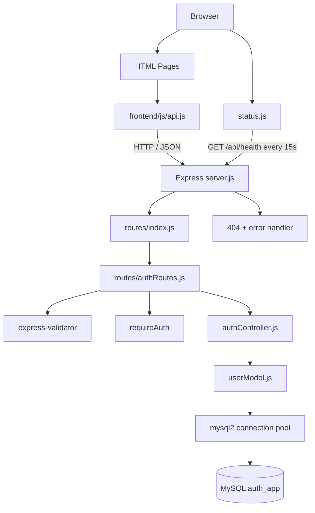
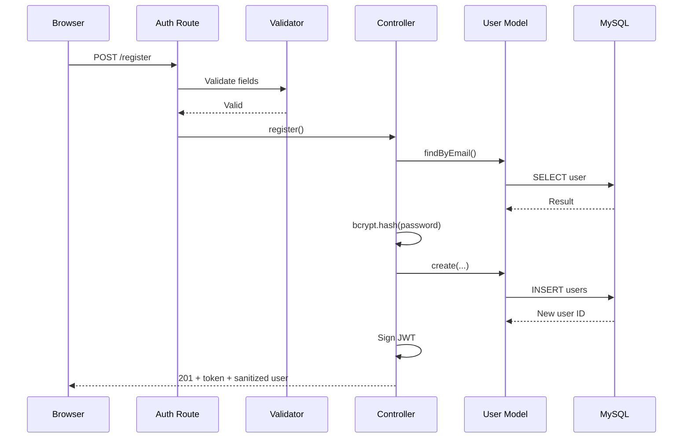
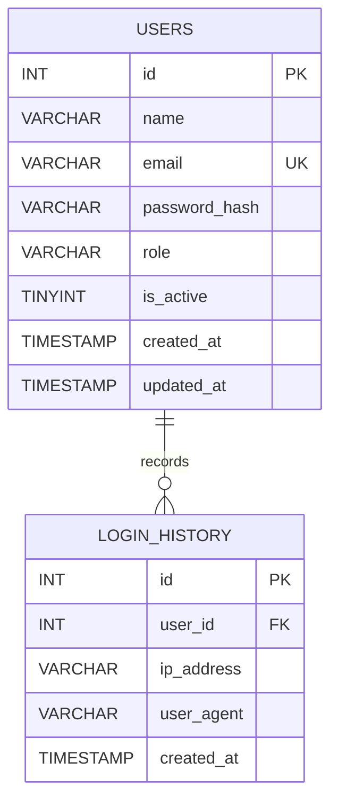
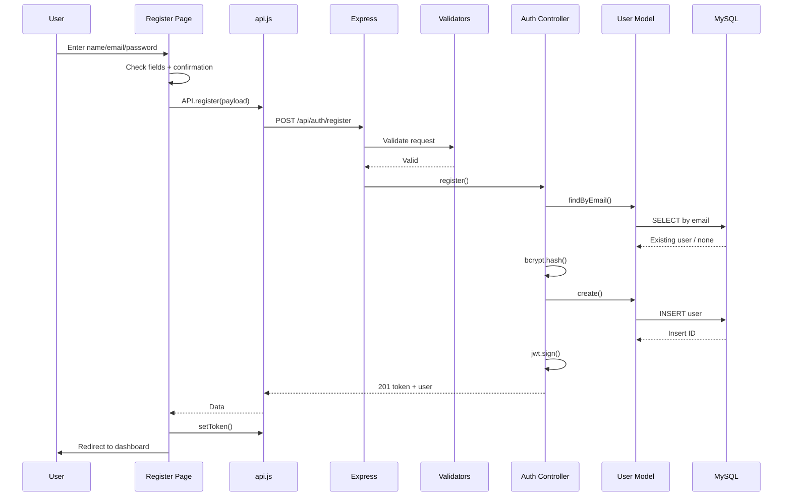
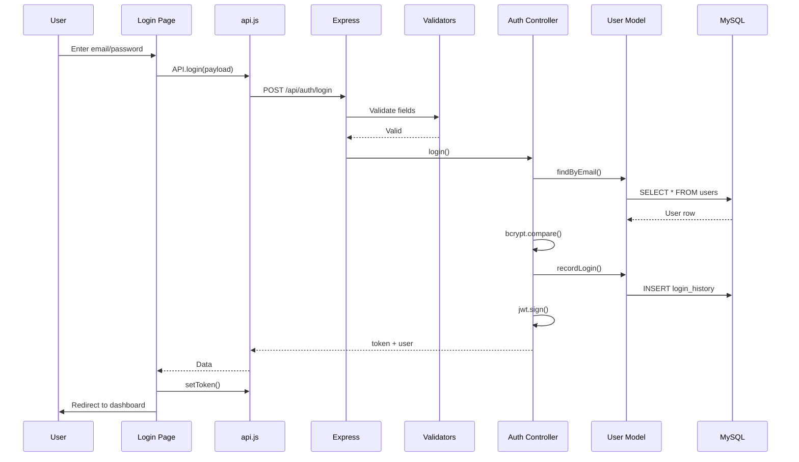

# Vault — Full-Stack Authentication Application

## 1. Overview

Vault is a small, extensible full-stack authentication application built as a reference implementation for a secure login flow.

The application demonstrates a complete path from a browser form to a MySQL-backed API:

```text
Vanilla HTML/CSS/JavaScript
        ↓
Shared browser API client
        ↓
Express REST API
        ↓
Validation + authentication middleware
        ↓
Controller layer
        ↓
Model layer
        ↓
MySQL connection pool
        ↓
users / login_history tables
```

The current repository intentionally keeps the feature set focused. It implements:

- user registration;
- user login;
- JWT-based authentication;
- bcrypt password hashing;
- protected `GET /api/auth/me` profile access;
- MySQL persistence;
- login-history recording;
- API health checking;
- centralized 404 and error handling;
- frontend connection-status feedback;
- a reusable structure for adding future resources and authenticated features.

> **Architecture note:** this is an MVC-style Node/Express application, not a microservice system. The repository separates concerns into configuration, routes, controllers, models, middleware, and frontend scripts, but everything runs as one backend application.

---

# 2. Goals and Design Principles

The project is designed around a few simple engineering principles:

| Principle | Implementation |
|---|---|
| Keep routing separate from business logic | `routes/` delegates to controllers |
| Keep SQL in one place | `models/userModel.js` contains user queries |
| Centralize authentication | `middleware/authMiddleware.js` |
| Validate incoming data | `middleware/validators.js` |
| Reuse a database pool | `config/db.js` |
| Centralize errors | `middleware/errorHandler.js` |
| Centralize browser API calls | `frontend/js/api.js` |
| Keep UI helpers reusable | `frontend/js/ui.js` |
| Make connectivity visible | `frontend/js/status.js` |
| Make future features easy to add | route/controller/model pattern |

The most important architectural idea is separation of responsibilities. A controller should not contain large SQL statements, a page should not construct raw `fetch()` URLs, and a route should not implement password hashing itself.

---

# 3. Technology Stack

## Frontend

- HTML5
- CSS3
- Vanilla JavaScript
- Fetch API
- Google Fonts for the visual design
- No frontend framework
- No frontend build step

The browser loads shared JavaScript modules as regular script files. The three main pages are `index.html`, `register.html`, and `dashboard.html`.

## Backend

- Node.js 18+
- Express 4
- CommonJS modules
- `dotenv`
- `cors`
- `express-validator`
- `jsonwebtoken`
- `bcryptjs`
- `mysql2/promise`
- `nodemon` for development

The backend package specifies Node.js `>=18.0.0`. citeturn561224view3

## Database

- MySQL
- InnoDB tables
- `utf8mb4` character set
- Connection pooling through `mysql2/promise`

The connection pool is configured with a limit of 10 connections. citeturn182027view0

---

# 4. Repository Structure

```text
vault-fullstack-app/
├── backend/
│   ├── config/
│   │   └── db.js
│   ├── controllers/
│   │   └── authController.js
│   ├── database/
│   │   ├── schema.sql
│   │   └── init.js
│   ├── middleware/
│   │   ├── authMiddleware.js
│   │   ├── errorHandler.js
│   │   └── validators.js
│   ├── models/
│   │   └── userModel.js
│   ├── routes/
│   │   ├── authRoutes.js
│   │   └── index.js
│   ├── .env.example
│   ├── package.json
│   └── server.js
│
├── frontend/
│   ├── css/
│   │   └── style.css
│   ├── js/
│   │   ├── api.js
│   │   ├── dashboard.js
│   │   ├── login.js
│   │   ├── register.js
│   │   ├── status.js
│   │   └── ui.js
│   ├── dashboard.html
│   ├── index.html
│   └── register.html
│
├── README.md
└── package-lock.json
```

---

# 5. Application Architecture



### Request responsibilities

The application follows this responsibility chain:

```text
Route
  ↓
Middleware / validation
  ↓
Controller
  ↓
Model
  ↓
Database
```

This keeps each layer small and makes the project straightforward to extend.

---

# 6. Backend Entry Point

**File:** `backend/server.js`

The backend performs these startup tasks:

1. Loads environment variables with `dotenv`.
2. Creates the Express application.
3. Enables CORS.
4. Enables JSON parsing.
5. Enables URL-encoded body parsing.
6. Mounts all API routes under `/api`.
7. Adds a root informational endpoint.
8. Adds 404 and centralized error handlers.
9. Tests MySQL connectivity before listening.
10. Starts the HTTP server on the configured port.

The default server port is `5000`. The application attempts a database connection before startup, but a failed connection only produces a warning; the server still starts and DB-backed requests will fail until the database is available. citeturn561224view4

### Root endpoint

```http
GET /
```

Response:

```json
{
  "message": "Auth App API is running. See /api/health."
}
```

---

# 7. Route Aggregation

**File:** `backend/routes/index.js`

This file is the central API router.

Current route map:

```text
/api/auth/*
/api/health
```

The authentication router is mounted as:

```text
/api/auth
```

The health endpoint verifies actual MySQL connectivity and returns either a healthy or degraded response. citeturn556233view0

### Why this structure is useful

When adding another feature—for example `posts`—the intended pattern is:

```text
models/postModel.js
controllers/postsController.js
routes/postsRoutes.js
routes/index.js → router.use('/posts', ...)
```

The main `server.js` does not need to be modified for each new feature because the central router remains the route aggregation point.

---

# 8. Authentication API

**File:** `backend/routes/authRoutes.js`

The current authentication routes are:

| Method | Endpoint | Authentication | Purpose |
|---|---|---|---|
| `POST` | `/api/auth/register` | Public | Create an account |
| `POST` | `/api/auth/login` | Public | Authenticate a user |
| `GET` | `/api/auth/me` | JWT required | Return the current user's profile |

The route definitions apply request validation to registration/login and `requireAuth` to `/me`. citeturn556233view1

---

# 9. Registration Flow

## Request

```http
POST /api/auth/register
Content-Type: application/json
```

```json
{
  "name": "Ada Lovelace",
  "email": "ada@example.com",
  "password": "StrongPassword123"
}
```

## Backend flow



### Registration rules

The backend validates:

- name must not be empty;
- name maximum length is 100 characters;
- email must be valid and normalized;
- password must be at least 8 characters. citeturn182027view2

The controller also checks whether the email already exists and returns `409` when a duplicate account is found. Passwords are hashed with bcrypt before insertion. citeturn556233view2

### Important role behavior

The `users` table contains a `role` field with default value `user`, but the current registration controller does **not** accept a role from the client. It creates the user with name, email, and password hash only, allowing the database default to apply. citeturn556233view2turn556233view5

This is a good security choice for the current simple implementation because a user cannot self-select an elevated role during registration.

---

# 10. Login Flow

## Request

```http
POST /api/auth/login
Content-Type: application/json
```

```json
{
  "email": "ada@example.com",
  "password": "StrongPassword123"
}
```

## Process

```text
Receive credentials
      ↓
Validate email/password
      ↓
Find user by email
      ↓
Check is_active
      ↓
Compare password with bcrypt hash
      ↓
Record login_history
      ↓
Sign JWT
      ↓
Return token + sanitized user
```

The current controller rejects inactive/non-existent users or incorrect passwords with HTTP `401`, records IP address and user agent for successful logins, and returns a signed token. citeturn556233view2

---

# 11. JWT Authentication

**File:** `backend/controllers/authController.js`

The JWT payload contains:

```json
{
  "sub": 123,
  "email": "ada@example.com",
  "role": "user"
}
```

The token is signed with `process.env.JWT_SECRET` and uses `JWT_EXPIRES_IN` when defined; otherwise the controller defaults to `7d`. citeturn556233view2

### Authorization header

Protected endpoints expect:

```http
Authorization: Bearer <jwt-token>
```

---

# 12. Authentication Middleware

**File:** `backend/middleware/authMiddleware.js`

`requireAuth`:

1. reads the `Authorization` header;
2. verifies the `Bearer` scheme;
3. verifies the JWT with `JWT_SECRET`;
4. attaches the decoded payload to `req.user`;
5. calls the next middleware/controller.

Malformed, missing, invalid, or expired tokens receive HTTP `401`. citeturn556233view4

### Role helper

The file also defines:

```js
requireRole(...allowedRoles)
```

which returns HTTP `403` unless `req.user.role` is one of the allowed roles. This helper is present as an extension point, but the current repository does not expose a separate role-protected application feature yet. citeturn556233view4

---

# 13. Protected Profile Endpoint

## `GET /api/auth/me`

This endpoint demonstrates the complete JWT-protected path.

```text
Browser
  ↓
Authorization: Bearer <token>
  ↓
requireAuth
  ↓
req.user.sub
  ↓
userModel.findById()
  ↓
MySQL
  ↓
Sanitized profile
```

The `findById` query deliberately selects only public columns rather than the password hash. The controller also returns `404` when the authenticated user's record cannot be found. citeturn556233view3turn556233view2

Example response:

```json
{
  "user": {
    "id": 1,
    "name": "Ada Lovelace",
    "email": "ada@example.com",
    "role": "user",
    "is_active": 1,
    "created_at": "2026-10-07 12:00:00",
    "updated_at": "2026-10-07 12:00:00"
  }
}
```

---

# 14. Password Security

The application uses `bcryptjs` for password hashing.

The number of rounds is controlled by:

```text
BCRYPT_SALT_ROUNDS
```

and defaults to `10` in the controller when the environment variable is missing. citeturn556233view2

The password hash is stored in:

```text
users.password_hash
```

It is never returned by the profile endpoint because `findById` selects public fields only, and the registration/login controller uses a sanitizer for returned user objects. citeturn556233view3turn556233view2

---

# 15. Database Layer

## Connection Pool

**File:** `backend/config/db.js`

The project uses `mysql2/promise` and creates one shared connection pool for the application.

Environment variables:

```text
DB_HOST
DB_PORT
DB_USER
DB_PASSWORD
DB_NAME
```

Defaults in code are:

```text
DB_HOST=localhost
DB_PORT=3306
DB_USER=root
DB_PASSWORD=
DB_NAME=auth_app
```

The pool is configured with:

```text
waitForConnections = true
connectionLimit = 10
queueLimit = 0
```

A reusable `testConnection()` function executes `SELECT 1` and is used by startup and `/api/health`. citeturn182027view0

---

# 16. Database Schema

**File:** `backend/database/schema.sql`

The schema creates the `auth_app` database and two tables.

## Entity Relationship



The actual schema defines a unique email, an `is_active` flag, timestamps, an index on email, and a foreign key from `login_history.user_id` to `users.id` with cascading delete. citeturn556233view5

---

# 17. Users Table

```sql
users (
    id,
    name,
    email,
    password_hash,
    role,
    is_active,
    created_at,
    updated_at
)
```

### Important constraints

- `id` is auto-incrementing primary key.
- `email` is unique and not null.
- `password_hash` is not null.
- `role` defaults to `user`.
- `is_active` defaults to `1`.

The email column also has an index. citeturn556233view5

---

# 18. Login History Table

```sql
login_history (
    id,
    user_id,
    ip_address,
    user_agent,
    created_at
)
```

A foreign key enforces the relationship with `users`:

```text
users.id → login_history.user_id
```

and deleting a user automatically removes its login-history rows through `ON DELETE CASCADE`. citeturn556233view5

Successful login requests create a login-history row containing the request IP and browser user-agent string. citeturn556233view2

---

# 19. Database Initialization

**File:** `backend/database/init.js`

Run:

```bash
npm run db:init
```

The script:

1. loads environment variables;
2. opens a temporary MySQL connection without selecting a database first;
3. reads `schema.sql` from disk;
4. executes all schema statements;
5. closes the connection.

This allows the application database and initial tables to be created in one command. citeturn182027view1

---

# 20. Input Validation

**File:** `backend/middleware/validators.js`

Validation is handled by `express-validator`.

### Register

```text
name     → trim + required + max 100
email    → trim + valid email + normalize
password → minimum 8 characters
```

### Login

```text
email    → trim + valid email + normalize
password → required
```

Validation errors are returned as:

```json
{
  "message": "Validation failed",
  "errors": [
    {
      "type": "field",
      "msg": "Password must be at least 8 characters.",
      "path": "password"
    }
  ]
}
```

The controller maps validation failures to HTTP `422`. citeturn182027view2turn556233view2

---

# 21. Error Handling

**File:** `backend/middleware/errorHandler.js`

The server installs error middleware last.

### 404 handling

Unknown endpoints return:

```json
{
  "message": "No route for GET /api/example"
}
```

### Central error handling

Known duplicate-record database errors (`ER_DUP_ENTRY`) map to `409`.

Other errors use:

```text
err.status || 500
```

and generic HTTP 500 responses hide the internal error message from the client. citeturn182027view3

---

# 22. Frontend Architecture

The frontend uses a page-oriented vanilla JavaScript structure.

```text
index.html
    └── login.js

register.html
    └── register.js

dashboard.html
    └── dashboard.js

Shared by all pages:
    api.js
    ui.js

Auth/register pages:
    status.js
```

There is no React, Vue, Angular, Vite, or bundler in the current frontend.

---

# 23. Login Page

**File:** `frontend/index.html`

The login page contains:

- email field;
- password field;
- validation hints;
- submit button;
- alert region;
- registration link;
- live API status indicator.

The page loads scripts in this order:

```text
api.js
ui.js
status.js
login.js
```

This ensures shared helpers exist before page-specific logic executes. citeturn182027view5

---

# 24. Registration Page

**File:** `frontend/register.html`

The registration page contains:

- full-name input;
- email input;
- password input;
- confirm-password input;
- field-level validation feedback;
- alert region;
- live API status indicator.

The browser performs an additional client-side check that `confirmPassword` matches the password before calling the server. citeturn182027view6turn342498view2

The backend remains the authoritative validator and still checks name, email, and minimum password length. citeturn182027view2

---

# 25. Dashboard

**File:** `frontend/dashboard.html`

The dashboard is protected on the client side by checking whether a token exists.

It displays:

- name;
- email;
- role;
- member-since date.

On load it calls:

```text
GET /api/auth/me
```

and fills the dashboard with the returned user profile. citeturn182027view7turn342498view3

### Unauthorized behavior

If `/api/auth/me` returns `401`:

```text
Clear token
    ↓
Redirect to index.html
```

Logout performs the same local token removal and redirect. citeturn342498view3

---

# 26. Shared Frontend API Client

**File:** `frontend/js/api.js`

The API client is the single source of truth for browser-to-backend requests.

Default API base URL:

```text
http://localhost:5000/api
```

It can be overridden by defining:

```javascript
window.API_BASE_URL = 'https://your-api.example.com/api';
```

before `api.js` runs. citeturn342498view0

### Available client methods

```text
API.register(payload)
API.login(payload)
API.me()
API.health()
```

### Token behavior

The client currently stores the JWT under:

```text
auth_app_token
```

in `localStorage`. For protected requests it automatically sends:

```http
Authorization: Bearer <token>
```

citeturn342498view0

### Error normalization

The shared client converts non-2xx API responses into JavaScript `Error` objects containing:

- status code;
- server message;
- validation details, when available.

It also identifies network failures with `isNetworkError`. citeturn342498view0

---

# 27. Client-Side Login Flow

**File:** `frontend/js/login.js`

```text
User submits login form
        ↓
Check email/password locally
        ↓
API.login()
        ↓
POST /api/auth/login
        ↓
Receive JWT
        ↓
API.setToken()
        ↓
Redirect to dashboard.html
```

If the request fails, the UI displays the returned message. The button is disabled and replaced with a loading state while the request is in progress. citeturn342498view1

---

# 28. Client-Side Registration Flow

**File:** `frontend/js/register.js`

```text
Submit registration
      ↓
Validate required fields
      ↓
Check password confirmation
      ↓
API.register()
      ↓
POST /api/auth/register
      ↓
Receive JWT
      ↓
Store token
      ↓
Redirect to dashboard
```

The page also displays multiple server-side validation errors together when the backend returns an error array. citeturn342498view2

---

# 29. Live Connection Status

**File:** `frontend/js/status.js`

The login and registration pages display a genuine API connectivity indicator.

On page load and every 15 seconds:

```text
GET /api/health
```

The status changes to:

```text
checking connection…
        ↓
API connected
```

or:

```text
API unreachable
```

The implementation is explicitly a live health check rather than a static visual indicator. citeturn342498view4

---

# 30. Shared UI Helpers

**File:** `frontend/js/ui.js`

The shared UI object provides small reusable functions:

```text
showAlert()
hideAlert()
setLoading()
fieldError()
clearFieldError()
```

These helpers keep page-specific scripts small and ensure error/loading states behave consistently. citeturn342498view5

---

# 31. Complete End-to-End Registration Flow



---

# 32. Complete End-to-End Login Flow



---

# 33. Dashboard Authentication Flow

```mermaid
flowchart TD
    A[Open dashboard.html] --> B{Token in localStorage?}
    B -->|No| C[Redirect to index.html]
    B -->|Yes| D[API.me()]
    D --> E[GET /api/auth/me]
    E --> F{JWT valid?}
    F -->|No / 401| G[Clear token + redirect to login]
    F -->|Yes| H[Controller loads user by JWT subject]
    H --> I[Return safe profile]
    I --> J[Render name, email, role, member date]
```

The client checks token presence before entering the page, but the server remains responsible for actual authentication through JWT verification. citeturn342498view3turn556233view4

---

# 34. API Reference

## Health

### `GET /api/health`

Returns HTTP `200` when the database connection works:

```json
{
  "status": "ok",
  "db": "connected",
  "time": "2026-10-07T12:00:00.000Z"
}
```

When MySQL cannot be reached, it returns HTTP `503`:

```json
{
  "status": "degraded",
  "db": "unreachable"
}
```

citeturn556233view0

## Authentication

| Method | Endpoint | Request | Success |
|---|---|---|---|
| `POST` | `/api/auth/register` | `name`, `email`, `password` | `201` |
| `POST` | `/api/auth/login` | `email`, `password` | `200` |
| `GET` | `/api/auth/me` | Bearer JWT | `200` |

---

# 35. HTTP Status Codes Used

| Status | Meaning in this project |
|---:|---|
| `200` | Successful login/profile/health request |
| `201` | Account successfully created |
| `401` | Missing, malformed, invalid, or expired credentials / invalid login |
| `409` | Duplicate account or duplicate-record database conflict |
| `422` | Request validation failure |
| `404` | Route or requested user not found |
| `500` | Unexpected server error |
| `503` | Health check cannot reach MySQL |

These mappings follow the current route/controller/error-handler implementation. citeturn556233view2turn556233view0turn182027view3

---

# 36. Environment Configuration

**File:** `backend/.env.example`

Current variables are:

```env
PORT=5000
NODE_ENV=development
CLIENT_ORIGIN=http://localhost:5500

DB_HOST=localhost
DB_PORT=3306
DB_USER=root
DB_PASSWORD=your_mysql_password
DB_NAME=auth_app

JWT_SECRET=replace_this_with_a_long_random_string
JWT_EXPIRES_IN=7d
BCRYPT_SALT_ROUNDS=10
```

The checked-in example file defines the same variable names and defaults, including a sample `CLIENT_ORIGIN`, database connection values, and auth settings. Replace sample credentials with your own local values and never commit a real `.env` file. citeturn182027view4

---

# 37. Local Setup

## Prerequisites

Install:

- Node.js 18 or later;
- npm;
- MySQL Server;
- optionally MySQL Workbench or another MySQL client.

## Step 1 — Clone

```bash
git clone https://github.com/Nilesh1729-cse/vault-fullstack-app.git
cd vault-fullstack-app
```

## Step 2 — Configure backend environment

```bash
cd backend
```

Copy:

```text
.env.example → .env
```

Then set your actual MySQL credentials and a strong JWT secret.

## Step 3 — Install backend dependencies

```bash
npm install
```

## Step 4 — Initialize MySQL

```bash
npm run db:init
```

This executes `database/schema.sql` and creates the `auth_app` database plus its tables. citeturn182027view1

## Step 5 — Start backend

Development:

```bash
npm run dev
```

Normal start:

```bash
npm start
```

Default URL:

```text
http://localhost:5000
```

## Step 6 — Start frontend

Open a second terminal:

```bash
cd frontend
npx serve -l 5500
```

or use VS Code Live Server.

Open:

```text
http://localhost:5500
```

This matches the repository's development configuration. citeturn182027view4turn561224view0

---

# 38. First-Time Demo Flow

For a quick lab/viva demonstration:

### 1. Verify backend health

Open:

```text
http://localhost:5000/api/health
```

Expected healthy response:

```json
{
  "status": "ok",
  "db": "connected"
}
```

### 2. Open registration

```text
http://localhost:5500/register.html
```

Create an account.

### 3. Observe automatic login

Registration returns a token and the frontend stores it, then redirects to the dashboard. citeturn342498view2turn556233view2

### 4. Show profile

The dashboard calls:

```text
GET /api/auth/me
```

### 5. Sign out

Click **Sign out**, which clears the local token and returns to login. citeturn342498view3

### 6. Sign in again

Use the same email/password on `index.html`.

---

# 39. Testing Through curl

## Health

```bash
curl http://localhost:5000/api/health
```

## Register

```bash
curl -X POST http://localhost:5000/api/auth/register \
  -H "Content-Type: application/json" \
  -d '{"name":"Ada Lovelace","email":"ada@example.com","password":"StrongPassword123"}'
```

## Login

```bash
curl -X POST http://localhost:5000/api/auth/login \
  -H "Content-Type: application/json" \
  -d '{"email":"ada@example.com","password":"StrongPassword123"}'
```

Save the returned JWT and call:

## Profile

```bash
curl http://localhost:5000/api/auth/me \
  -H "Authorization: Bearer YOUR_JWT_HERE"
```

---

# 40. How to Add a New Backend Feature

The repository is structured specifically to make feature additions predictable.

Suppose the next feature is `posts`.

## Step 1 — Add a table

Create a table or migration referencing users when needed.

Example concept:

```text
posts
 ├── id
 ├── user_id
 ├── title
 └── created_at
```

## Step 2 — Add model

```text
backend/models/postModel.js
```

Put raw SQL here.

## Step 3 — Add controller

```text
backend/controllers/postsController.js
```

Keep HTTP request/response logic here.

## Step 4 — Add routes

```text
backend/routes/postsRoutes.js
```

Example:

```js
router.get('/', controller.list);
router.post('/', requireAuth, controller.create);
```

## Step 5 — Register route

In `backend/routes/index.js`:

```js
router.use('/posts', require('./postsRoutes'));
```

The route becomes:

```text
/api/posts
```

This mirrors the extension strategy already documented inside `routes/index.js`. citeturn556233view0

---

# 41. How to Add a New Frontend Feature

The frontend follows the same reusable pattern.

## Step 1 — Add an API client method

In `frontend/js/api.js`:

```js
posts: () => request('/posts', { auth: true }),
```

## Step 2 — Add a page

Create:

```text
posts.html
```

Reuse the existing styles and shared scripts.

## Step 3 — Add page-specific logic

Create:

```text
js/posts.js
```

Call:

```js
const data = await API.posts();
```

The existing `api.js` is explicitly designed so individual pages do not build `fetch()` requests and URLs themselves. citeturn342498view0

---

# 42. Security Model

The application already demonstrates several useful security basics:

### Password hashing

Passwords are hashed with bcrypt before being stored. citeturn556233view2

### JWT verification

Protected routes verify the Bearer JWT on the server. citeturn556233view4

### Input validation

Registration and login requests are validated before controller logic runs. citeturn182027view2

### Password-hash exclusion

The profile query selects safe fields rather than returning `password_hash`. citeturn556233view3

### Centralized errors

Unexpected internal errors are translated to generic responses rather than exposing their full server-side message. citeturn182027view3

---

# 43. Current Security Limitations

This project is a clean reference implementation, not a production-hardened identity platform.

## JWT storage

The frontend stores the access token in `localStorage`. This is convenient for a simple demo but increases exposure to token theft in an XSS scenario. citeturn342498view0

A production system should consider an `httpOnly`, `secure`, `sameSite` cookie strategy or another carefully designed session mechanism.

## CORS

The backend uses:

```js
cors({ origin: process.env.CLIENT_ORIGIN || '*' })
```

The development fallback is therefore permissive. Production should set `CLIENT_ORIGIN` to the actual frontend origin. citeturn561224view4

## JWT secret

`JWT_SECRET` must be a long, random secret and must not be committed to source control.

## Login rate limiting

There is currently no rate limiter on login or registration. A production deployment should add rate limiting and abuse controls.

## Password lifecycle

The current feature set does not include password reset, email verification, MFA, refresh-token rotation, or account lockout policies.

---

# 44. Important Accuracy Notes

For reports, interviews, and viva explanations, describe the current implementation exactly.

### Accurate statements

- “The frontend is built with vanilla HTML, CSS, and JavaScript.”
- “The backend uses Node.js and Express.”
- “MySQL is accessed through `mysql2/promise`.”
- “The project follows an MVC-style structure.”
- “Authentication uses JWT and bcrypt.”
- “Login history is stored in MySQL.”
- “There is a reusable role-checking middleware helper.”
- “The current API has registration, login, profile, and health endpoints.”

### Avoid claiming

- “This is a MERN stack application.”
- “MongoDB is used.”
- “There is a refresh-token system.”
- “There is OAuth/social login.”
- “There is production-grade session management.”
- “Role-based admin pages are already implemented.”
- “The application uses microservices.”

The README itself correctly distinguishes the project from strict MERN because the database is MySQL rather than MongoDB. citeturn561224view0

---

# 45. Viva / Interview Explanation

A good concise explanation is:

> **Vault is a full-stack authentication reference application. The frontend is built with vanilla HTML, CSS, and JavaScript, while the backend uses Node.js and Express with an MVC-style structure. MySQL stores users and login history.**
>
> **For registration, the server validates the input, checks whether the email already exists, hashes the password using bcrypt, stores the user, and returns a JWT. For login, it verifies the password hash, records the login event, and issues another JWT.**
>
> **The JWT is sent in the Authorization Bearer header. Protected routes use authentication middleware to verify the token and attach the decoded payload to `req.user`. The `/api/auth/me` endpoint then uses the JWT subject to fetch the user's safe profile from MySQL.**
>
> **The frontend centralizes all API calls in `api.js` and stores the token in localStorage. The dashboard uses the protected profile endpoint, while the login and registration pages also poll `/api/health` every 15 seconds to display a real backend connection status.**
>
> **The project is intentionally simple but extensible: new features can be added using the same model-controller-route pattern without changing the main server entry point.**

---

# 46. Potential Future Improvements

A natural next version could add:

- password reset;
- email verification;
- refresh tokens or server-backed sessions;
- MFA/OTP;
- account lockout after repeated failures;
- login attempt rate limiting;
- CSRF protection where applicable;
- audit-log viewer;
- admin/user management;
- role-protected routes and pages;
- profile editing;
- password change;
- tests with Jest/Supertest or another test framework;
- API documentation using OpenAPI/Swagger;
- Dockerized MySQL + backend setup;
- frontend build tooling when the application grows.

---

# 47. Source-Level Technical Map

| File | Responsibility |
|---|---|
| `backend/server.js` | Express bootstrap, middleware, routes, startup |
| `backend/config/db.js` | Shared MySQL pool + connectivity check |
| `backend/routes/index.js` | Central API route aggregator + health endpoint |
| `backend/routes/authRoutes.js` | Registration, login, profile routes |
| `backend/controllers/authController.js` | Auth request/response and JWT logic |
| `backend/models/userModel.js` | User SQL operations |
| `backend/middleware/authMiddleware.js` | JWT verification + role helper |
| `backend/middleware/validators.js` | Register/login validation rules |
| `backend/middleware/errorHandler.js` | 404 + centralized error responses |
| `backend/database/schema.sql` | MySQL database/table definitions |
| `backend/database/init.js` | One-time schema initialization |
| `frontend/index.html` | Login UI |
| `frontend/register.html` | Registration UI |
| `frontend/dashboard.html` | Protected profile UI |
| `frontend/js/api.js` | Shared HTTP client + token storage |
| `frontend/js/login.js` | Login form behavior |
| `frontend/js/register.js` | Registration form behavior |
| `frontend/js/dashboard.js` | Protected profile loading + logout |
| `frontend/js/status.js` | Live API health indicator |
| `frontend/js/ui.js` | Shared DOM/UI helpers |
| `frontend/css/style.css` | Visual design system |

---

# 48. Final Architecture Summary

```text
                    VAULT
                     │
          ┌──────────┴──────────┐
          │                     │
     FRONTEND                BACKEND
 HTML/CSS/JS               Node + Express
          │                     │
       api.js             routes/index.js
          │                     │
          │              authRoutes.js
          │                     │
          │             authController.js
          │                     │
          │               userModel.js
          │                     │
          └────────────→ MySQL
                         ├── users
                         └── login_history
```

The system is small enough to understand end-to-end and structured enough to demonstrate real software-engineering concepts: layered design, input validation, password hashing, JWT authentication, database abstraction, protected routes, error handling, and reusable client/server extension patterns.
